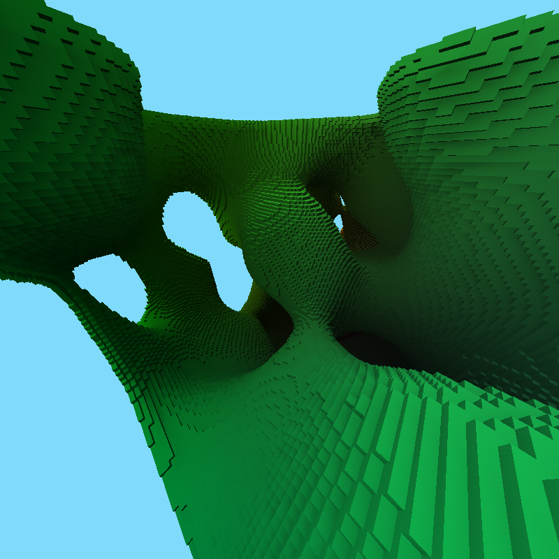
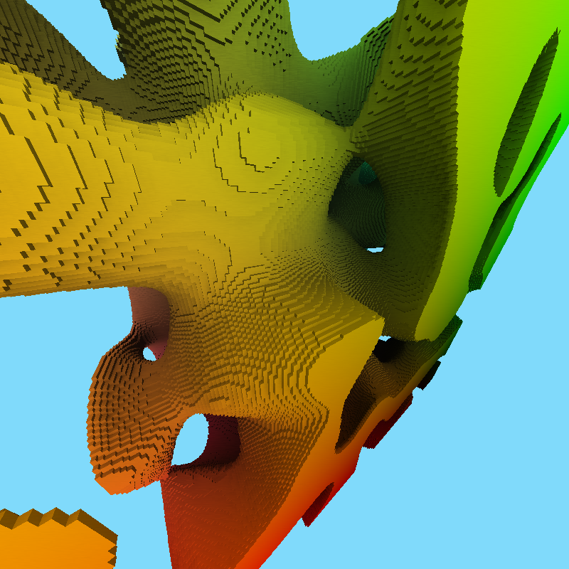

# LIME - Voxel Renderer

I am experimenting with caching per-voxel brightness data by hashing the voxels
world space position and storing at that index in a fixed size buffer. My code
can explain better that I can!

The images are not from the most recent commit.
